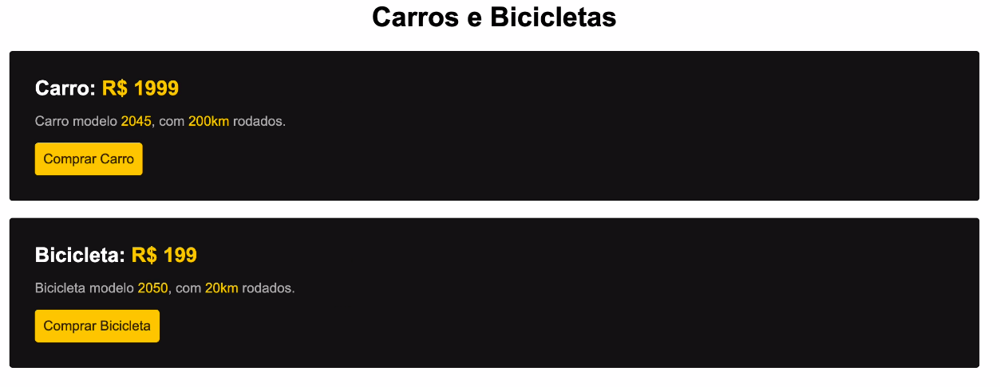

# Resultado final

 

## Cores e fontes utilizadas

-   Amarelo 1: (preço/botão): #febe01
-   Amarelo 2: (color botão): #332200
-   Preto: #111
-   Cinza: #b2b2b2
-   Font: Arial
-   Alinhar texto ao centro: text-align: center;
-   Arredondar bordas: border-radius: 10px;

## Textos:

### Carros e Bicicletas

#### Carro: R$ 1999

#### Carro modelo 2045, com 200km rodados.

#### Bicicleta: R$ 199

#### Bicicleta modelo 2050, com 20km rodados.
